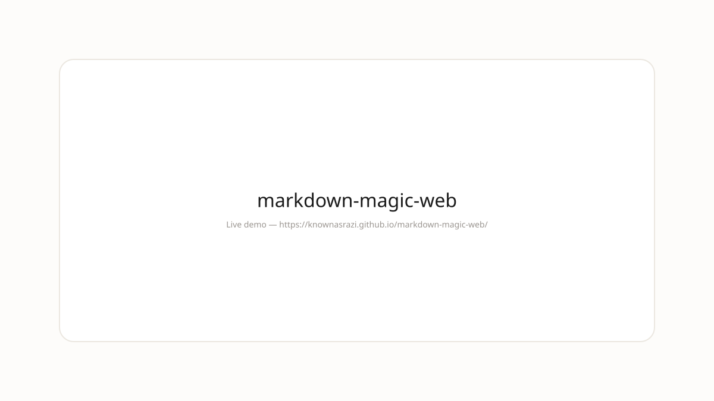

>   

---
## Demo



**Live:** https://knownasrazi.github.io/markdown-magic-web/

> Screenshot is a placeholder — Pages deploys on push to `main`.

---


# markdown-magic-web — Markdown, magically live.

Live markdown magic - preview, slides, and export to PDF or HTML.

---

## Changelog-aware

This README is the changelog. Every release is a commit.

**v1.0.0** — Initial clean release. Markdown + Vite core, stone tokens, and a clean surface.

## Install

```bash
git clone https://github.com/knownasrazi/markdown-magic-web.git
cd markdown-magic-web
bun install && bun run dev
```

## Why clean?

Because tools should feel like paper. Clean is paper that has lived a little.

## License

MIT — [Razi](https://github.com/knownasrazi)
